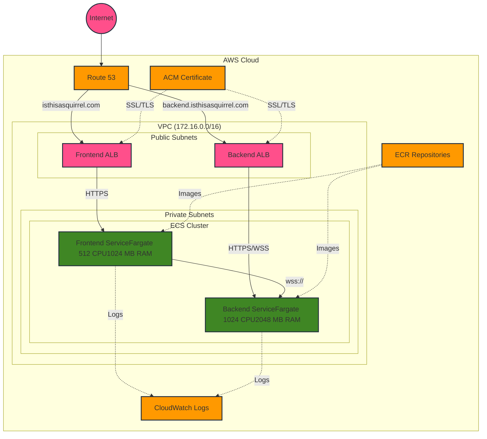

# Animal Classifier Application

Scalable microservices architecture for real-time image classification using AWS ECS, ALB, and WebSockets

An image classification application that uses MobileNetV2 to identify animals in images. The application consists of a FastAPI backend for WebSocket-based image processing and a Streamlit frontend for user interaction.

## Architecture



## Infrastructure

The application is deployed on AWS using:

- ECS Fargate for containerized services
- Application Load Balancers for HTTPS/WebSocket traffic
- Route 53 for DNS management
- ACM for SSL/TLS certificates
- CloudWatch for logging and monitoring

### Key Components

- **Frontend**: Streamlit application served via HTTPS
- **Backend**: FastAPI application with WebSocket support
- **Model**: TensorFlow MobileNetV2 for image classification

## Prerequisites

- AWS Account with appropriate permissions
- AWS CLI configured
- Python 3.9+
- Docker installed
- AWS CDK installed
- Domain name with Route 53 hosted zone
- SSL certificate in ACM

## Repository Structure

```
├── backend
│   ├── Dockerfile
│   ├── main.py
│   └── requirements.txt
├── frontend
│   ├── Dockerfile
│   ├── app.py
│   └── requirements.txt
├── infrastructure
│   ├── README.md
│   ├── app.py
│   ├── infrastructure_stack.py
│   └── requirements.txt
└── scripts
    └── monitor-deployment.sh
```

## Deployment Instructions

1. **Set Environment Variables**

```bash
export CDK_DEFAULT_ACCOUNT=your-aws-account-id
export CDK_DEFAULT_REGION=your-aws-region
export CERTIFICATE_ARN=your-certificate-arn
```

2. **Build and Push Docker Images**

```bash
# Build backend image
docker buildx build --platform linux/amd64 -t animal-classifier-backend ./backend
docker tag animal-classifier-backend:latest $AWS_ACCOUNT.dkr.ecr.$AWS_REGION.amazonaws.com/animal-classifier-backend:latest
docker push $AWS_ACCOUNT.dkr.ecr.$AWS_REGION.amazonaws.com/animal-classifier-backend:latest

# Build frontend image
docker buildx build --platform linux/amd64 -t animal-classifier-frontend ./frontend
docker tag animal-classifier-frontend:latest $AWS_ACCOUNT.dkr.ecr.$AWS_REGION.amazonaws.com/animal-classifier-frontend:latest
docker push $AWS_ACCOUNT.dkr.ecr.$AWS_REGION.amazonaws.com/animal-classifier-frontend:latest
```

3. **Deploy Infrastructure**

```bash
cd infrastructure
pip install -r requirements.txt
cdk deploy
```

4. **Monitor Deployment**

```bash
./scripts/monitor-deployment.sh
```

## Monitoring and Debugging

### Using the Monitoring Script

The `monitor-deployment.sh` script provides real-time information about:

- Service deployment status
- Task health
- Target group status
- CloudWatch logs

### Manual Checks

```bash
# Check service status
aws ecs describe-services --cluster AnimalClassifierCluster --services BackendService

# View logs
aws logs tail /aws/ecs/backend --follow
```

## Security

- HTTPS enforced for all traffic
- WebSocket connections over WSS
- Network isolation using VPC
- Least privilege IAM roles
- Container security best practices

## Development

### Local Testing

1. Run backend:

```bash
cd backend
pip install -r requirements.txt
uvicorn main:app --reload
```

2. Run frontend:

```bash
cd frontend
pip install -r requirements.txt
streamlit run app.py
```

### Making Changes

1. Update application code
2. Build and push new Docker images
3. Update infrastructure if needed
4. Deploy changes using CDK

## Troubleshooting

Common issues and solutions:

1. **WebSocket Connection Issues**

   - Check DNS propagation
   - Verify security group rules
   - Check SSL certificate validity

2. **Container Startup Issues**

   - Check CloudWatch logs
   - Verify environment variables
   - Check container health checks

3. **Deployment Issues**
   - Use monitoring script to identify problems
   - Check CloudFormation events
   - Verify IAM permissions

## Contributing

1. Fork the repository
2. Create a feature branch
3. Make changes
4. Submit a pull request

## License

MIT License
